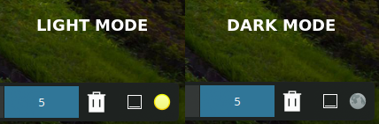
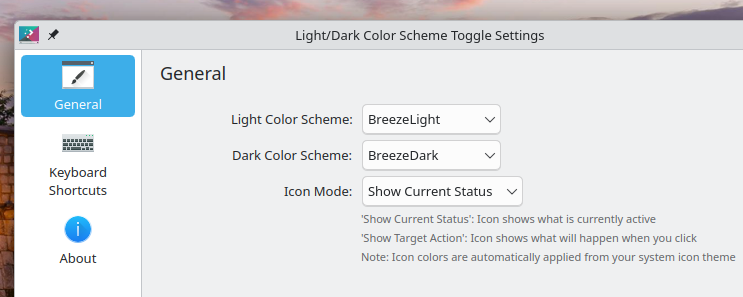

<p align="center">
  
</p>

# Light/Dark Color Scheme Toggle

A minimal KDE Plasma 6 panel widget that switches your color scheme between light and dark with a single click.


## Screenshots





## Features

- One-click toggle between any two installed color schemes (defaults: `BreezeLight` / `BreezeDark`).
- Pick which schemes count as "light" and "dark" in the widget settings.
- Choose whether the panel icon shows the **current state** (moon when dark) or the **target action** (sun when dark, to indicate clicking will switch to light).
- Exposes a `Toggle Color Scheme` action, so you can bind a global keyboard shortcut to it via *System Settings → Shortcuts*.

## Requirements

- KDE Plasma 6.0 or newer
- `plasma-apply-colorscheme` (ships with Plasma)

## Install

### From source

```bash
git clone https://github.com/dscafati/plasma-light-dark-toggle.git
cd plasma-light-dark-toggle
./install.sh
```

Then reload Plasma so the chooser sees the new widget:

```bash
kquitapp6 plasmashell && kstart plasmashell
```

Right-click your panel → *Add Widgets…* → search **Light/Dark Color Scheme Toggle** → drag it to the panel.

### Manual install

```bash
kpackagetool6 --type Plasma/Applet --install io.github.dscafati.lightdarktoggle
```

To upgrade an existing install, replace `--install` with `--upgrade`.

### Test without adding to the panel

```bash
plasmoidviewer6 -a io.github.dscafati.lightdarktoggle
```

## Configuration

Right-click the widget → *Configure Light/Dark Color Scheme Toggle…*

| Setting | Description |
|---|---|
| **Light Color Scheme** | The scheme used when toggling to "light". |
| **Dark Color Scheme** | The scheme used when toggling to "dark". |
| **Icon Mode** | `Show Current Status` — the icon mirrors what is active. `Show Target Action` — the icon shows what clicking will switch *to*. |

The dropdowns are populated from `plasma-apply-colorscheme --list-schemes`, so any color scheme installed on your system is available.

## Uninstall

```bash
kpackagetool6 --type Plasma/Applet --remove io.github.dscafati.lightdarktoggle
```

Or simply remove the directory:

```bash
rm -rf ~/.local/share/plasma/plasmoids/io.github.dscafati.lightdarktoggle
```

## Credits

The logo and the in-widget sun/moon icons are derived from the [Breeze icon theme](https://invent.kde.org/frameworks/breeze-icons) (`weather-clear.svg` and `weather-clear-night.svg`), © 2014 Uri Herrera and the KDE community, released under the GNU Lesser General Public License v3.0 or later.

## License

The widget itself is released under the [GNU General Public License v2.0 or later](LICENSE). Bundled Breeze icons retain their original LGPL-3.0-or-later license.
